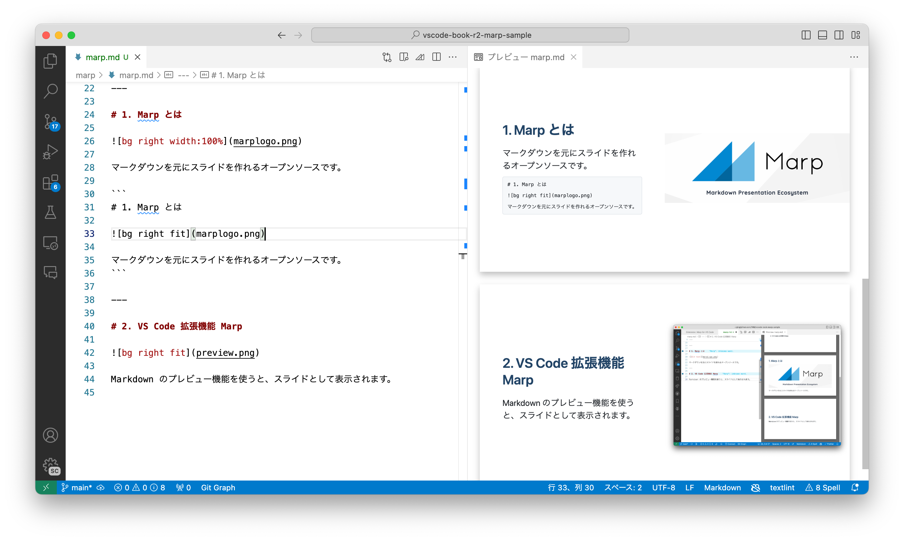

<!-- _class: lead -->

# VS Code 実践ガイド Marp サンプル

Atsushi Morimoto (@74th)

---

# 目次

1. Marp とは
2. VS Code 拡張機能 Marp

---

# 1. Marp とは


マークダウンを元にスライドを作れるオープンソースです。

```
# 1. Marp とは


マークダウンを元にスライドを作れるオープンソースです。
```

---

# 2. VS Code 拡張機能 Marp



Markdown のプレビュー機能を使うと、スライドとして表示されます。
